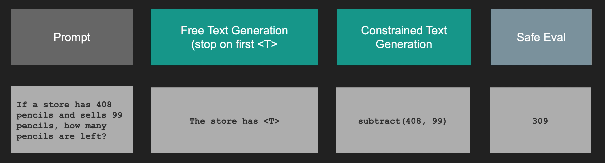

# FuncQA Experiments: Syntax error-free decoding for Math Equations

<p align="center">
    
</p>

This repo shows two methods for syntax error-free decoding 

 - using a context-free grammar (defined with lark)
 - using a finite-state automtata that is evaluated directly on the GPU and thus 4x faster

It uses these approaches to improve the performance of the Zephyr 7B LLM on FuncQA, a math equation benchmark. This approach outperforms current state-of-the-art. 

It was developed as part of a seminar at [HPI](hpi.de). Here are additional resources 

 - [**Slides**](./docs/slides.pdf) outlining the basic idea
  - [**Report**](./docs/report.pdf) outlining the approach in-depth


## Results 

The results of this results vs. the ToolDec baseline from the literature and ChatGPT is as follows. Details are given in the report. 

| Model Name                         | Results |
|------------------------------------|---------|
| Zephyr 7B Chat (ours) + CFG        | 14.7%   |
| Zephyr 7B Chat (ours) + CFG + SFT  | 19.1%   |
| ToolDec                            | *13.2%  |
| ChatGPT (0-shot)                   | *9.0%*  |


## Literature

The methods implemented here are inspiered by the following two papers 

1. ToolDec: Syntax Error-Free and Generalizable Tool Use for LLMs via Finite-State Decoding [[arxiv]](https://arxiv.org/pdf/2310.07075.pdf)
2. ToolkenGPT: Augmenting Frozen Language Models with Massive Tools via Tool Embeddings [[arxiv]](https://arxiv.org/abs/2305.11554)


## Running the experiments 

You can simply reproduce the experiments by running 

```
pip install ./requirements.txt
sh scripts/training_commands.sh
sh scripts/eval_commands.sh
```